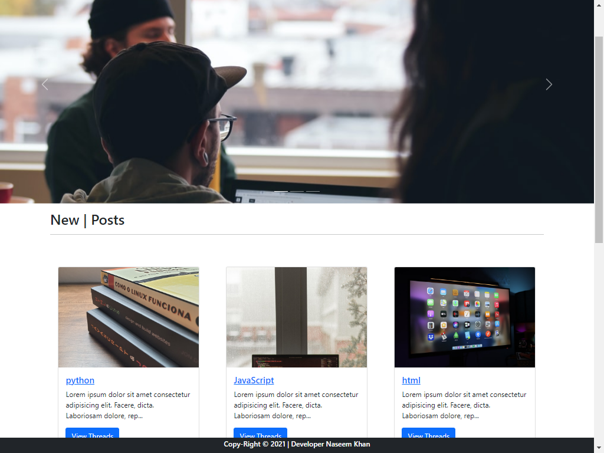
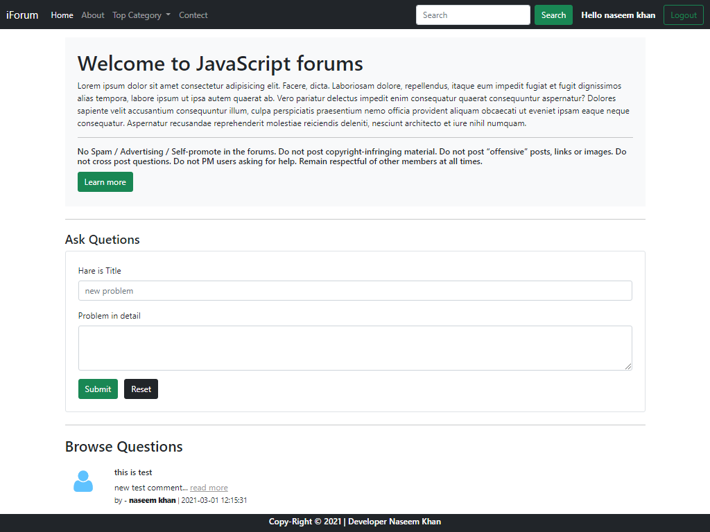
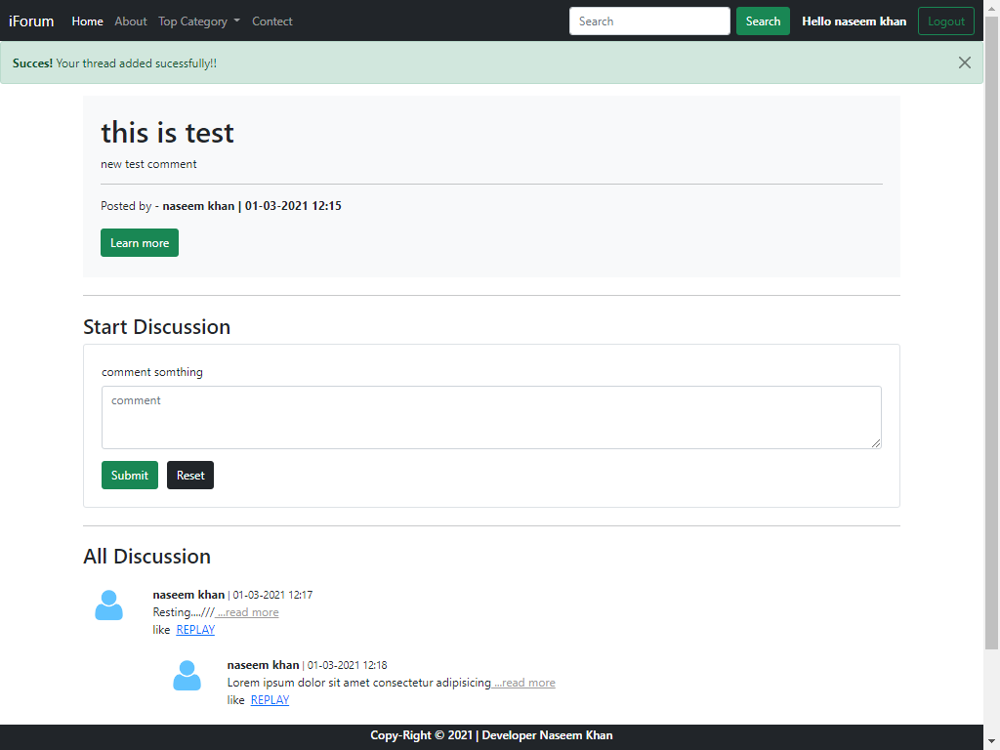
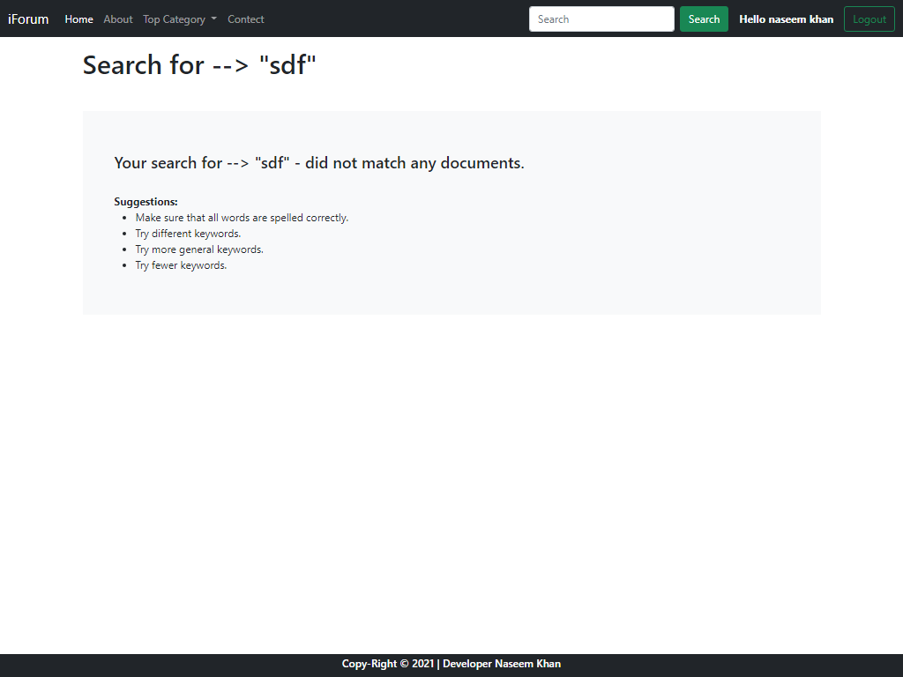

# Get Started
for Queck starting the programe install xampp from hare --> [https://www.apachefriends.org/download.html]. start mysqli and apache than open phpMyadmin make forum DB and make users, comments, replay, thread, categories table make it firt.

## How to use
for starting make sure all table are make properly. Than start the "mysql and apache" then search "localhost/forum" in you favorite browser.
Make sure all sqli file are import in Phpmysql first make the iforum db. than import my slq file in hare[http://localhost/phpmyadmin/db_structure.php?server=1&db=iforum].
table preview ....
"Make sure this repository in this file location befor searching  -> [C:\xampp\htdocs\forum] in window same mac."

# Web preview
## Home

## Threads List

## Thread

## Search

